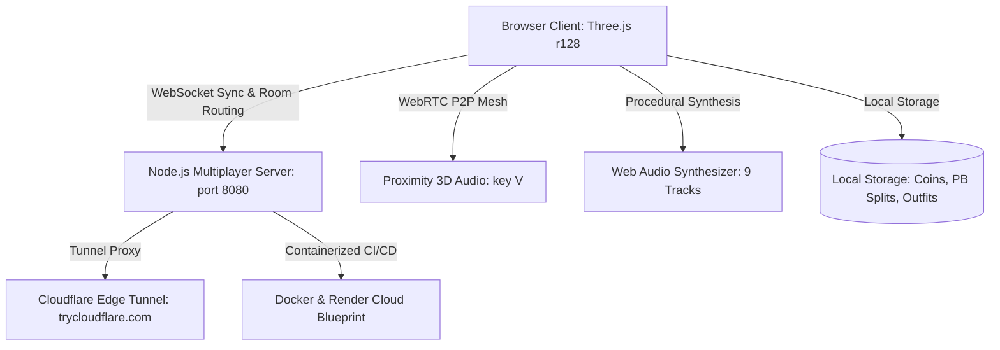

# 🎮 Roblox 3D Obby Simulation - Pro Multiplayer & Gaming Edition

[](https://github.com/soumyadeepmagnusx/roblox-obby-sim/actions/workflows/ci.yml)
[](https://opensource.org/licenses/MIT)
[](https://nodejs.org/)
[](https://threejs.org/)

A high-performance 3D gaming platform built in the true spirit of **Roblox**, featuring **Real-Time Multiplayer with Rooms**, **WebRTC Proximity Voice Chat**, **3D Cartoon Speech Bubbles**, **Speedrun Split Timer & Personal Bests**, **Vehicles (Cyber Hoverboard & Jetpack)**, **Pets & Mystery Egg Hatching**, **PvP Combat & Rocket Launchers**, **Bengali & English Hit Music**, an **Anti-Glitch & Security Engine**, and an in-game **Roblox Studio Sandbox Builder**.

---

## 🌟 Architecture Diagram



---

## 🌐 Instant Play & Online Access

* **Local Play (Active Server)**: **[http://localhost:8080](http://localhost:8080)**
* **Local Network (Friends on Same Wi-Fi)**: **`http://192.168.1.7:8080`** *(Works seamlessly on phones, tablets & laptops)*
* **1-Click Worldwide Cloudflare Tunnel**: Double-click **`start_online_tunnel.bat`** for a high-speed public HTTPS link with **zero passwords** and **zero 503 errors**!
* **1-Click Render.com Cloud**: Connect this repo to [Render.com](https://render.com) for 24/7 hosting.
* **GitHub Repository**: **[https://github.com/soumyadeepmagnusx/roblox-obby-sim](https://github.com/soumyadeepmagnusx/roblox-obby-sim)**

---

## 🎮 Complete Keyboard Controls Reference

| Action | Key / Control | Description |
| :--- | :--- | :--- |
| **Movement** | `W` `A` `S` `D` / Arrow Keys | Move avatar in 3D world |
| **Jump** | `Spacebar` | Jump over gaps and obstacles |
| **Camera Orbit** | Right Click + Drag | Rotate 3D camera angle |
| **Zoom** | Mouse Scroll Wheel | Zoom camera in and out |
| **Shift Lock** | `Left Shift` / `Right Shift` | Locks camera behind character with centered crosshair |
| **Reset Character** | `R` | Triggers classic "OOF!" ragdoll and respawns at active checkpoint |
| **Restart Speedrun** | `T` (or click Timer HUD) | Resets timer to 0:00 and teleports back to Stage 1 Spawn |
| **Voice Chat (Mic)** | `V` | Toggles microphone on/off with 3D proximity volume and overhead indicator |
| **Chat & Speech Bubbles**| `/` or `Enter` | Opens chat box; messages float as 3D cartoon speech bubbles above head |
| **Hoverboard** | `H` | Mounts glowing cyber hoverboard with +120% speed and banking physics |
| **Jetpack Thrust** | Hold `J` / Hold `Space` | Activates dual rocket thrusters with smoke and flame exhaust particles |
| **Interact / Grab** | `E` | Hatches mystery eggs at spawn or grabs physics crates to throw |
| **Hotbar Slots** | `1` to `6` | Equips Speed Coil, Gravity Coil, Sword, Grapple Hook, Grab Gun, Rocket Launcher |
| **Attack / Fire** | Left Click | Swings sword for PvP melee or fires explosive rocket projectile |
| **Studio Builder** | `B` | Toggles sandbox building mode to place custom colored blocks |
| **Atmosphere Theme** | `L` (or click HUD) | Cycles Day, Sunset, Night Starfield, and Synthwave Neon |
| **Boombox Music** | Click Top-Right UI / `M` | Cycles through 9 procedural Bengali and English tracks |
| **Daily Streak Rewards** | Click Topbar 🔥 Pill | Opens 7-day login streak rewards modal with coin bonuses |

---

## 🎙️ WebRTC Proximity Voice Chat & 3D Speech Bubbles (`voice.js` & `speech_bubbles.js`)

* **3D Proximity Audio**: Real-time Peer-to-Peer WebRTC voice chat. Audio scales with distance—friends sound louder as you walk closer to them.
* **Overhead Speaking Indicator**: A green glowing microphone speaker sprite appears above your avatar's head while transmitting.
* **Cartoon 3D Speech Bubbles**: When anyone types in chat, a clean white billboard speech bubble with rounded corners and a cartoon tail floats above their character in 3D for 5 seconds.

---

## ⏱️ Speedrun Timer, Splits & Personal Bests (`game.js`)

* **Millisecond Precision**: Real-time HUD displaying `MM:SS.mmm`.
* **Personal Best (PB) Tracking**: Automatically saves your fastest time to `localStorage`.
* **Split Delta Indicators**: Shows green `(-X.Xs)` when ahead of your best run or red `(+X.Xs)` when behind at every stage checkpoint.
* **1-Key Restart**: Press **`T`** anytime to restart your speedrun attempt from Spawn.
* **Victory Celebration**: Reaching the final trophy stage triggers gold confetti particle explosions and victory sound!

---

## 👥 Multiplayer Rooms & Cloudflare Tunneling (`server.js` & `network.js`)

* **Private Room URL**: Add `?room=squad` to your link (e.g. `https://....trycloudflare.com/?room=mysquad`) to create an isolated world just for your friends.
* **Zero-Password Tunnel**: Powered by Cloudflare's high-speed edge tunnel (`start_online_tunnel.bat`), eliminating the unstable 503 errors and password splash screens of legacy tunnels.
* **Full HTTPS / WSS Support**: Enables secure microphone permissions across all web browsers.

---

## 🛹 Vehicles, Pets & Economy (`vehicles.js`, `pets.js`, `collectibles.js`)

* **Cyber Hoverboard (Press `H`)**: 2.2x speed multiplier with banking body tilt.
* **Dual Thruster Jetpack (Press `J`)**: Dynamic flight with fuel HUD bar that automatically recharges on the ground.
* **Mystery Egg Hatching**: Walk up to the golden pedestal at Spawn and press **`E`** to hatch one of 4 animated 3D pets:
  * 🐶 **Neon Doge** (+25% Coins)
  * 🐱 **Pixel Kitty** (+35% Coins, +10% Speed)
  * 🐉 **Cosmic Dragon** (+50% Coins, +25% Super Jump, flapping wings)
  * 👑 **Golden Dominus** (2x Coins, +30% Speed & Jump)
* **40+ 3D Gold Coins**: Distributed across stages, sky islands, and mega slides.

---

## 📻 Procedural Bengali & English Music Playlist (`music_player.js`)

Synthesized entirely via the Web Audio API—zero external audio file downloads required:
1. 🇧🇩 **Purano Shei Diner Kotha** (Rabindranath Tagore Classic)
2. 🇧🇩 **Ami Shudhu Cheyechi Tomay** (Romantic Bengali Theme)
3. 🇧🇩 **Bojhena Shey Bojhena** (Iconic Bengali Melody)
4. 🇧🇩 **Barandaye Roddur** (Bhoomi Folk Rock)
5. 🌍 **Faded** (Alan Walker Global Anthem)
6. 🌍 **The Spectre** (Alan Walker EDM)
7. 🌍 **Astronomia** (Coffin Dance Anthem)
8. 🎮 **Megalovania** (Undertale Arcade Battle)
9. 🎮 **Bad Apple!!** (Touhou Arcade Hit)

---

## 🛡️ Anti-Glitch & Security Engine (`security.js`)

* **Continuous Collision Detection (CCD)**: Sub-stepping algorithm prevents high-velocity tunneling through obstacles.
* **Enterprise DDoS Shield**: Per-IP rate limiting (240 requests/minute).
* **AI Chat Moderation**: Instant `####` redaction for toxic language.
* **Admin Controls**: Type `/admin roblox2026` in chat to unlock custom sandbox privileges.

---

## 🐳 Docker & Cloud Deployment

### Docker
```bash
docker build -t roblox-obby-sim .
docker run -p 8080:8080 roblox-obby-sim
```

### Render.com
Push this repository to GitHub and select **New Web Service** on Render. The included `render.yaml` blueprint will configure the service automatically.

---

## 📜 License & Contributions

* **License**: [MIT License](LICENSE) &copy; 2026 Soumyadeep.
* **Contributions**: Pull requests are welcome! Read [CONTRIBUTING.md](CONTRIBUTING.md) for full developer instructions.
